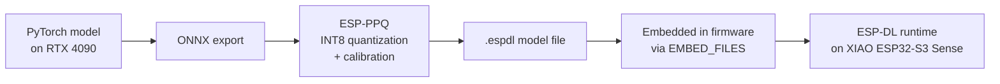
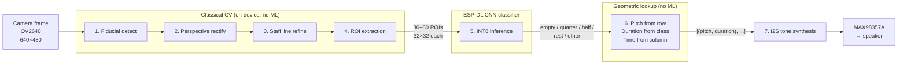

# ADR-017: ESP-DL for On-Device Vision in Melody Detector

**Status**: proposed
**Date**: 2026-04-26
**Confidence**: 8/10

---

## Context

A new project, **melody-detector**, will let a child draw musical notes on
a pre-printed staff sheet, photograph the drawing with the on-board camera,
and play the resulting melody through a MAX98357A I2S amplifier and
speaker.

Hardware:

- **XIAO ESP32-S3 Sense** — dual-core LX7, 8 MB Octal PSRAM, OV2640 camera,
  PIE vector instructions for INT8 SIMD.
- **MAX98357A** — I2S Class-D mono amplifier driving a small speaker.
- Pre-printed staff sheets with corner fiducials for camera alignment.

The vision task: locate noteheads on the staff and classify each one's
position (which line or space) and optionally duration. The detector must
run on-device so the project works offline as a self-contained toy.

Two structurally different paths exist:

1. **Classical CV** (OpenCV-style staff-line detection + blob extraction).
   Cheap, deterministic, but limited to highly constrained input
   (dots-in-cells style sheets, no freeform note shapes).
2. **On-device ML** with a small CNN. Tolerates messy kid drawings, varied
   note shapes, off-line noteheads — at the cost of model authoring,
   training, and quantization.

This ADR covers path 2: which TinyML framework to use. We retain classical
CV as a useful preprocessing step (staff-line detection, ROI extraction)
upstream of the model.

We also have an RTX 4090 for local training and Gemini API access for
synthetic data and oracle labeling, which makes the OSS-end-to-end path
viable as a showcase project.

## Decision

Use **ESP-DL v3.x** as the on-device inference framework. Train models in
PyTorch on the local workstation, quantize to INT8 with **ESP-PPQ**, and
ship `.espdl` model files as part of the firmware.

### Training pipeline

### Runtime pipeline

### Model approach

- Stage 1 (classical CV, on-device): detect the corner fiducials on the
  pre-printed sheet, compute a perspective homography to rectify the image,
  refine the 5 staff lines by per-row darkness peak, and extract a grid of
  32×32 ROIs covering each beat-column × staff-row intersection.
- Stage 2 (ESP-DL, on-device): a small INT8 CNN (~50–200 KB) classifies
  each ROI as `empty / quarter / half / rest / other`.
- Pitch is determined geometrically from ROI row index, not by the model.

This split keeps the model small and fast (a classifier, not a detector)
and offloads spatial reasoning to deterministic geometry. The pre-printed
sheets that anchor this geometry are in
[`packages/audio/melody-detector/sheets/`](../../packages/audio/melody-detector/sheets/).

### Training data

- **Bulk (~95%)**: programmatic rendering of staff sheets with random note
  positions, durations, and styles, plus albumentations for paper texture,
  perspective warp, lighting, blur, ink-bleed, and stroke jitter.
- **Diversity (~5%)**: ControlNet-conditioned diffusion (FLUX or SDXL on
  the 4090) seeded with programmatic templates, to inject stylistic
  variation that augmentations can't produce.
- **Validation set**: ~50–100 real photographs of kid drawings, labeled
  via **Gemini Robotics-ER 1.6** as an oracle, with 10% spot-checked by
  hand.

## Consequences

**Positive**

- Best inference performance on ESP32-S3 — ESP-DL's PIE assembly kernels
  are 2–10× faster than TFLM equivalents.
- Native ESP-IDF integration; no extra runtime to maintain.
- ESP-PPQ provides mature post-training quantization with calibration and
  per-layer sensitivity analysis.
- All-OSS pipeline (PyTorch + ESP-DL + ESP-PPQ) is showcase-friendly and
  reproducible.
- No vendor lock-in to a SaaS labeling/training platform.

**Negative**

- `.espdl` model format is ESP32-only and not portable to other
  targets.
- ONNX export step adds a serialization hop between PyTorch and ESP-PPQ.
- Quantization calibration requires a representative dataset (~1K images)
  and produces minor accuracy degradation that must be measured.
- ESP-DL community is smaller than TFLM — expect to occasionally read
  source.

## Alternatives Considered

Detailed evaluations live in
[`docs/reference/tinyml-esp32-frameworks.md`](../reference/tinyml-esp32-frameworks.md).

1. **TFLite Micro + ESP-NN** — Mature, large community, but slower than
   ESP-DL on ESP32-S3 because kernels are not vectorized for PIE
   instructions. Picked only for projects on classic ESP32 (no S3).
2. **ExecuTorch** — Pure-PyTorch end-to-end and cross-target portable, but
   the ESP32 backend is early (2024+) with incomplete operator coverage
   and inference speed behind ESP-DL on the same hardware. Defer until the
   ecosystem matures.
3. **Edge Impulse** — Lowest-friction workflow, free Developer tier
   sufficient for hobby use. Rejected because the SaaS lock-in conflicts
   with the OSS-showcase goal, free-tier projects are public, and
   generated firmware uses TFLM under the hood (slower than ESP-DL).
4. **LiteRT (TFLite successor)** — Targets phones / Pi / desktop edge, no
   MCU backend. Not applicable.
5. **Pure classical CV (no ML)** — Viable for grid-style sheets where each
   cell is "filled or not." Rejected because we want to support freeform
   note shapes (quarter / half / rest distinction) that classical CV
   cannot reliably distinguish.
6. **Cloud inference (Gemini Robotics-ER 1.6 at runtime)** — Highest
   accuracy and zero on-device ML complexity, but requires WiFi at
   runtime, adds 500 ms+ latency per shot, and per-API-call cost. Used as
   a labeling oracle during development; not a runtime dependency.

For the data-pipeline alternatives (programmatic vs diffusion vs real
photos) see
[`docs/reference/synthetic-image-generation.md`](../reference/synthetic-image-generation.md).

For labeling-service alternatives (Gemini Robotics-ER, Claude Vision,
self-hosted Florence-2) see
[`docs/reference/vision-labeling-services.md`](../reference/vision-labeling-services.md).

## Implementation Notes

- Project location: `packages/audio/melody-detector/` (audio-domain toy
  with vision input; sits alongside `kids-audio-toy` and
  `audiobook-player`).
- Training scripts live in a sibling directory
  `packages/audio/melody-detector/training/` (gitignored model artifacts;
  reproducible from `gen.py` + seed).
- Model artifact (`model.espdl`) embedded in firmware via ESP-IDF's
  `EMBED_FILES`.
- Calibration dataset: 1K samples drawn from the synthetic generator.
- RAM budget for inference: ≤ 1 MB PSRAM (well under the S3 Sense's 8 MB).
- Inference latency target: < 200 ms per ROI batch on a 5×8 grid sheet.

## Related

- ADR-013: Single-Board XIAO ESP32-S3 Sense (hardware family)
- `docs/reference/tinyml-esp32-frameworks.md`
- `docs/reference/vision-labeling-services.md`
- `docs/reference/synthetic-image-generation.md`
