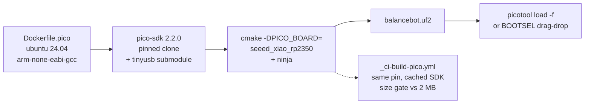
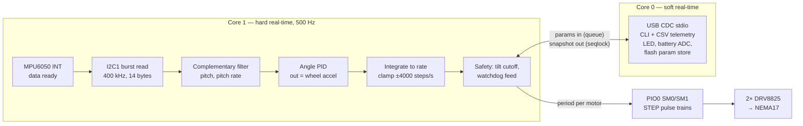

# ADR-018: Pico SDK Toolchain and Balancebot Control Architecture

**Status**: proposed
**Date**: 2026-07-02
**Confidence**: 8/10

---

## Context

A new project, **balancebot** ([PRD-012](../requirements/PRD-012-balancebot.md)),
is a two-wheel self-balancing robot on a Seeed XIAO RP2350 — the repo's
first firmware target that is not an ESP32. Hardware:

- **XIAO RP2350** — dual Cortex-M33 @ 150 MHz, 520 KB SRAM, 2 MB flash,
  3 PIO blocks (12 state machines), no radio.
- **MPU6050** — 6-axis IMU on I2C, data-ready interrupt.
- **2× DRV8825** — STEP/DIR stepper drivers, 1/8 microstepping, driving
  NEMA17 motors (1600 steps/rev effective).

Balancing an inverted pendulum with steppers imposes two hard real-time
requirements the existing ESP-IDF toolchain and patterns don't address:

1. A deterministic sensor→filter→PID loop (target 500 Hz, jitter budget
   ~100 µs) that must not be perturbed by USB traffic or telemetry.
2. Continuous step-pulse trains whose frequency changes 500 times per
   second without glitches — any irregular pulse is an audible tick and
   a lost microstep.

Everything in the repo assumes ESP-IDF (`tools/esp32*.just`,
`Dockerfile`, `_ci-build-esp32.yml`), so this ADR decides both the
toolchain story and the control architecture.

## Decision

Four coupled decisions:

1. **Raspberry Pi Pico SDK (C/C++), pinned at 2.2.0**, built inside a
   container, mirroring the repo's containerized ESP-IDF pattern.
2. **PIO state machines generate step pulses** — one SM per motor.
3. **Dual-core split**: core 1 runs the hard-real-time control loop;
   core 0 runs USB, CLI, telemetry, and flash writes.
4. **Complementary filter** for pitch estimation, with the PID output
   treated as wheel **acceleration** (integrated to step rate).

### Toolchain / build flow



- The SDK is acquired by pinned `git clone` in `Dockerfile.pico` (not a
  git submodule): a vendored SDK would bloat every checkout, and the
  ESP-IDF precedent also keeps the toolchain in the image, not the tree.
  Only the `tinyusb` submodule is initialized (needed for USB CDC
  stdio).
- **picotool** is built at the matching tag and preinstalled in the
  image and CI cache, because SDK ≥ 2.0 shells out to it to produce
  UF2s and must not fetch it from the network mid-build.
- CI installs the apt ARM toolchain and caches the SDK clone directly
  instead of building the Docker image per run — there is no official
  prebuilt Pico image (unlike `espressif/idf`), and an apt toolchain +
  cached clone is faster. Parity with local builds comes from pinning
  the same SDK tag and `PICO_BOARD`.

### Runtime architecture



### Why PIO for step generation (the marquee decision)

A DRV8825 needs a clean square edge per microstep, ≥ 1.9 µs high. At
4000 steps/s per motor the CPU alternatives are poor:

- **Timer-IRQ bit-bang**: 2 × 4 kHz interrupts competing with USB and
  the control loop; every delayed IRQ is a stretched period — audible
  jitter and, at worst, a skipped step under load.
- **Hardware PWM slices**: frequency changes require rewriting TOP/DIV;
  updates near the wrap boundary glitch, and frequency resolution gets
  coarse at high rates (integer divider).

A PIO state machine clocked at 1 MHz runs this program independently of
both CPUs:

```
pull noblock      ; new period from FIFO, else reuse X (hold last rate)
mov x, osr
set pins, 1 [1]   ; STEP high, 2 µs — DRV8825 needs >= 1.9
lp: jmp x-- lp    ; STEP low for (period - 2) µs
```

Pulses are cycle-accurate by construction; the control loop just pushes
a new 32-bit period each tick. `pull noblock` gives "hold last rate"
for free when the FIFO is empty. Below ~30 steps/s the CPU parks the SM
instead (a 1 MHz/32-bit period bottoms out there anyway); direction
changes pass through zero rate, so the DIR setup time (200 ns) is
trivially met. This uses 2 of the 12 state machines.

### Why the control loop owns core 1

TinyUSB servicing and `printf` telemetry produce milliseconds-scale
bursts on whichever core runs them — precisely when a human is tuning
over USB. Pinning the control loop to core 1 makes the 2 ms tick
deterministic without priority gymnastics. Exchange is lock-free:
a `pico_util` queue carries parameter updates in (core 0 → core 1), a
sequence-counted double buffer carries telemetry snapshots out — the
control loop never blocks and never allocates.

### Why complementary filter + acceleration command

- `angle = α·(angle + gyro·dt) + (1−α)·atan2(ax, az)` with α ≈ 0.98 at
  500 Hz is standard, deterministic, and tunable with one parameter.
- Steppers give no torque feedback; the natural command is velocity.
  Balancing force is proportional to wheel *acceleration*, so the PID
  output is treated as acceleration and integrated to a step rate —
  the topology proven by the B-robot family of stepper balancers.
- A slow outer loop (100 Hz) feeds wheel velocity back into a small
  angle-setpoint offset so the robot leans against drift and holds
  station.

## Consequences

**Positive**

- Deterministic step pulses and control timing by construction, not by
  tuning interrupt priorities.
- The repo gains a second MCU platform with the same ergonomics as the
  ESP-IDF flow: `just balancebot::build` → UF2, containerized, CI-built.
- Pure-C control modules (PID, filter, param CRC) are host-testable —
  the repo's first CI-run firmware unit tests.
- No radio and no OTA means a small, auditable firmware.

**Negative**

- A second toolchain (SDK pin, picotool pin, CI workflow) to maintain.
- No OTA story: updates require physical USB access (acceptable for a
  robot that lives on a desk).
- Flash writes stall XIP for both cores; mitigated by writing gains via
  `flash_safe_execute()` only while motors are disarmed.
- The pico-sdk board header claims 4 MB flash but Seeed specs 2 MB; the
  parameter sector is hard-pinned near the end of 2 MB (valid either way)
  and the CI size gate assumes 2 MB until measured on hardware.
- The A2 silicon errata constrain two details: internal pull-downs are
  unreliable (RP2350-E9), so the IMU INT input uses no pull and the loop
  paces on edges with a deadline fallback; and UF2 downloads erase the
  last flash block (picotool's RP2350-E10 workaround), so the parameter
  sector is the second-to-last sector, not the last.

## Alternatives Considered

1. **Arduino (arduino-pico core)** — fastest bring-up, many balancer
   examples, but diverges from the repo's CMake/container/CI patterns
   and hides the PIO/multicore control we specifically want. Rejected.
2. **MicroPython / CircuitPython** — a 500 Hz loop with GC pauses and
   no reliable sub-ms timing is the wrong tool for an inverted
   pendulum. Rejected.
3. **Zephyr / NuttX** — industrial RTOSes with XIAO RP2350 support, but
   a heavyweight third build system for a two-task firmware. Rejected.
4. **PWM-slice or timer-IRQ step generation** — see Decision; both
   jitter under USB load. Rejected.
5. **MPU6050 DMP for attitude** — silicon quaternion engine, but an
   opaque undocumented blob, 200 Hz max output, and awkward INT
   semantics. The complementary filter is 10 lines and inspectable.
   Kalman/Mahony add nothing for 1-DOF tilt at this sensor quality.
   Rejected for v1.
6. **DC gearmotors + encoders (robocar-style)** — reuses repo patterns
   but adds backlash and an inner velocity loop; steppers with
   microstepping are the established easy path for small balancers, and
   the parts are on hand. Rejected.

## Implementation Notes

- Project: `packages/robotics/balancebot/` (new `robotics` domain).
- Pins (single source of truth `src/pin_config.h`): I2C1 SDA/SCL =
  GPIO6/7 (D4/D5), MPU INT = GPIO5 (D3), STEP L/R = GPIO2/3 (D8/D10),
  DIR L/R = GPIO4/0 (D9/D6), shared nENABLE = GPIO1 (D7) with external
  10 kΩ pull-up to 3V3 so drivers stay disabled through boot/BOOTSEL.
- DRV8825 M0/M1/M2 hardwired to 1/8 microstep; Vref current-limit
  procedure documented in `WIRING.md`.
- SDK pin: `pico-sdk` 2.2.0 (`seeed_xiao_rp2350` board header present
  since 2.1.1); picotool pinned to the same tag.
- Watchdog ~100 ms, fed only from the core-1 loop; the external
  nENABLE pull-up guarantees motors stay off through the reboot a
  stalled loop triggers.
- Host unit tests build `pid.c`, `imu_filter.c`, and the param-store
  CRC with the system compiler (no SDK headers) in CI.

## Related

- [PRD-012: Balancebot](../requirements/PRD-012-balancebot.md)
- [XIAO RP2350 board reference](../reference/boards/xiao-rp2350.md)
- [ADR-001: Monorepo Structure](../decisions/ADR-001-monorepo-structure.md)
- [ADR-002: Dual ESP32 Architecture](ADR-002-dual-esp32-architecture.md) — the repo's other robot
