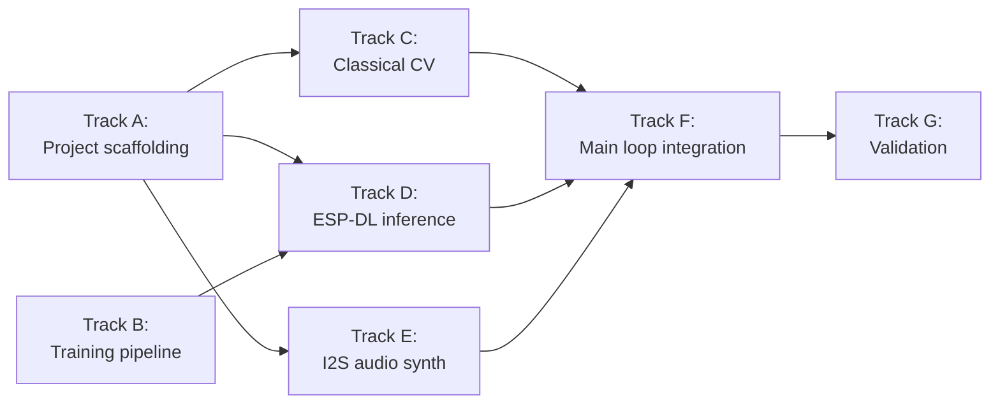

# PRP: Melody Detector — Implementation Plan

**Status**: planned
**Source**: PRD-011, ADR-017
**Priority**: P2
**Confidence**: 7/10

---

## Goal

Implement the melody-detector firmware and training pipeline as specified
in [PRD-011](../requirements/PRD-011-melody-detector.md) using the
architecture chosen in
[ADR-017](../decisions/ADR-017-melody-detector-esp-dl.md). Deliver an
end-to-end OSS pipeline: synthetic data → PyTorch training → INT8
quantization → ESP-DL deployment → on-device playback.

## Background

The melody-detector project is a children's toy and TinyML showcase
combining classical CV (deterministic geometry from pre-printed
fiducials) with a small INT8 CNN (per-ROI classification). PRD-011
defines the requirements; this PRP defines the build order, track
dependencies, and deliverables for each track.

The project lives at `packages/audio/melody-detector/` and is registered
in the monorepo root justfile and CI matrix.

## Track Dependencies

Tracks A and B have no dependencies and can start in parallel. Tracks C,
D, and E all depend on A's project structure and can run in parallel
once A is merged. Track F is the integration point. Track G closes the
loop with on-hardware measurements.

## Implementation Plan

### Track A — Project scaffolding (Phase 1)

**Deliverables**

- `packages/audio/melody-detector/` ESP-IDF project skeleton
- `CMakeLists.txt`, `main/CMakeLists.txt`, `main/main.c` (stub)
- `sdkconfig.defaults` enabling: PSRAM, OV2640 camera driver, I2S, ESP-DL
  managed component
- `partitions.csv` matching the standard dual-OTA layout (1.8 MB app,
  factory + ota_0 + ota_1)
- `justfile` importing `tools/esp32-idf.just`, defining `flash` and
  `info` recipes
- Root `justfile` registers the module: `mod melody-detector
  'packages/audio/melody-detector'`
- CI matrix entry in `.github/workflows/esp32-build.yml`
- Skeleton `README.md`, `WIRING.md`, `CLAUDE.md` (use the
  `project-readme`, `wiring-doc`, `project-claude-md` skills)
- Status LED feedback patterns

**Acceptance**

- `just melody-detector::build` succeeds in the container
- CI builds the firmware on every push
- Binary fits the 1.8 MB OTA partition

### Track B — Training pipeline (Phase 5)

**Deliverables**

- `packages/audio/melody-detector/training/` Python package managed by
  `uv`
- `gen.py` — synthetic ROI generator using PIL + albumentations
- `dataset.py` — PyTorch `Dataset` wrapper with seedable shuffle / split
- `model.py` — small CNN, 3–4 conv layers, ~50–200 KB INT8 weights
- `train.py` — training loop with WandB / TensorBoard logging optional
- `export.py` — ONNX export with the opset ESP-PPQ requires
- `quantize.py` — ESP-PPQ INT8 quantization with calibration set
- `pytest` tests for the generator (output shapes, label correctness,
  reproducibility from seed)
- `pyproject.toml` with reproducible dependency pins

**Acceptance**

- `uv run python gen.py --seed 0 --out data/` produces a deterministic
  dataset (verified by `sha256sum`)
- `uv run python train.py` produces a model checkpoint at ≥ 95 %
  validation accuracy on synthetic data
- `uv run python quantize.py` produces a `model.espdl` artifact
- All tests pass on `pytest`

### Track C — Classical CV pipeline (Phase 2)

**Deliverables**

- `main/cv_pipeline.h` — public API: `cv_extract_rois(frame, rois_out)`
- `main/cv_pipeline.c` — implementation: fiducial detect, homography,
  staff line refinement, ROI extraction
- `main/cv_homography.c` — 3 × 3 matrix math (no float-heavy deps)
- Host-buildable: `CONFIG_IDF_TARGET_LINUX=y` with Unity test harness
  using a fixture image set
- Test fixtures derived from the synthetic generator output (Track B)

**Acceptance**

- Host tests pass on Linux + macOS in CI
- Per-stage timing instrumented and logged
- ROI extraction produces correctly-sized outputs (32 × 32) at known
  positions

### Track D — ESP-DL inference (Phase 3)

**Deliverables**

- `main/inference.h/c` — load model from `EMBED_FILES`, allocate input /
  output tensors, batch-infer ROIs
- ESP-DL managed component dependency in `idf_component.yml`
- Stub `model.espdl` until Track B finishes (fixed-output stub for
  pipeline testing)
- Memory-instrumentation hooks for `uxTaskGetStackHighWaterMark` and
  `heap_caps_get_free_size`

**Acceptance**

- Model loads at boot without error
- 56-ROI batch inference completes in < 250 ms on hardware
- Total PSRAM footprint < 1 MB (model + activations + ROI buffer)

### Track E — I2S audio synthesis (Phase 4)

**Deliverables**

- `main/audio.h/c` — I2S driver setup for MAX98357A, DDS oscillator,
  ADSR envelope, note-sequence playback
- Pitch lookup table for treble-clef rows (covered in PRD-011 FR-4.01)
- Configurable tempo and gain
- Test mode that plays a known scale on boot for hardware verification

**Acceptance**

- Test mode emits a clean major scale through the speaker
- No audible clicks at note boundaries (envelope verified on a 'scope or
  by ear)
- Sample buffer underrun rate = 0 over a 10-second playback

### Track F — Main loop integration

**Deliverables**

- `main/main.c` — orchestrator: button → capture → CV → inference →
  synth → playback
- FreeRTOS task layout (capture / CV / inference on Core 1, audio on
  Core 0 with audio task at priority 10)
- Button GPIO + debounce
- Status LED state machine
- End-to-end smoke test on real hardware

**Acceptance**

- Button press → first audio sample in < 1 second
- Recovers cleanly from a sheet that has no detectable fiducials
  (graceful error tone)
- Handles back-to-back captures without leaking memory

### Track G — Validation (Phase 6)

**Deliverables**

- `validation/` directory with the real-photo holdout (gitignored;
  documented collection process)
- `validation/oracle_label.py` — Gemini Robotics-ER 1.6 oracle labeling
  script
- `validation/benchmark.py` — runs both on-device model and oracle on the
  same set, computes per-class confusion matrix
- README section publishing the benchmark numbers

**Acceptance**

- ≥ 90 % per-ROI accuracy on the real-photo holdout (PRD-011 acceptance
  criterion)
- Benchmark numbers documented in the project README
- Oracle-labeling script reproducible with documented prompt + API
  version

## Skills to Use

The following project-level skills should be invoked as appropriate
during implementation:

- `project-readme` — Track A README scaffolding
- `wiring-doc` — Track A WIRING.md
- `project-claude-md` — Track A CLAUDE.md
- `register-project` — Track A justfile + CI registration
- `sdkconfig-audit` — Track A sdkconfig.defaults audit
- `wifi-sta-setup` — only if WiFi/OTA is added in v2 (out of scope for
  v1)
- `embedded-best-practices` — review C/C++ code in tracks C, D, E, F
- `review-firmware` — pre-merge review on each firmware track
- `lint` — pre-commit on every track
- `monitor` / `flash` / `develop` — bring-up and on-device debugging
- `safe-build-operations` — guarded build / flash commands

## Test Framework

- **Track B (Python)**: `pytest` with `--cov`, run via
  `cd packages/audio/melody-detector/training && uv run pytest`
- **Track C (C/C++)**: ESP-IDF Unity with `CONFIG_IDF_TARGET_LINUX=y`
  for host-based tests; fixture images checked into the repo
- **Tracks D, E, F (firmware)**: manual hardware tests + log-based
  smoke tests
- **Track G**: oracle benchmark script committed; numbers regenerated
  on demand

## Acceptance Criteria

Mirror PRD-011's acceptance criteria. Specifically:

- [ ] On-device per-ROI classification ≥ 90 % on the real-photo holdout
- [ ] End-to-end latency from button press to first audio sample < 1 s
- [ ] Firmware fits the 1.8 MB OTA partition (enforced in CI)
- [ ] Synthetic dataset reproducible from a single seed
- [ ] External developer can build, train, and flash the system in < 1
  day from a clean checkout
- [ ] Benchmark vs. Gemini Robotics-ER 1.6 published in the project
  README

## Risks and Mitigations

| Risk | Mitigation |
|---|---|
| ESP-DL `.espdl` quantization quality lower than expected | Mixed-precision quantization (INT8 conv, INT16 final FC); retrain with quantization-aware training if needed |
| Fiducial detection unreliable under low-contrast lighting | Add a flash LED alongside the camera; document required lighting in the README |
| Synthetic-to-real domain gap > expected | Increase albumentations diversity; add ControlNet-stylized samples; collect more real photos for the holdout |
| Inference latency exceeds 250 ms target | Reduce ROI grid density (skip pre-filtered empty patches); consider INT8 first-conv vector intrinsics |
| MAX98357A audible clicks at low volume | Add software DC blocker; ensure ADSR release is ≥ 5 ms |

## Out of Scope (Deferred to v2)

- WiFi provisioning + Improv-WiFi
- OTA via GitHub Releases
- Polyphony / chord recognition
- Note durations beyond quarter / half / rest
- Companion mobile app
- Multi-language pitch-letter labels (German B vs. American B)
- Battery / portable enclosure

## Related Documents

- [PRD-011: Melody Detector](../requirements/PRD-011-melody-detector.md)
- [ADR-017: ESP-DL for On-Device Vision](../decisions/ADR-017-melody-detector-esp-dl.md)
- [TinyML frameworks reference](../reference/tinyml-esp32-frameworks.md)
- [Vision labeling services reference](../reference/vision-labeling-services.md)
- [Synthetic image generation reference](../reference/synthetic-image-generation.md)
