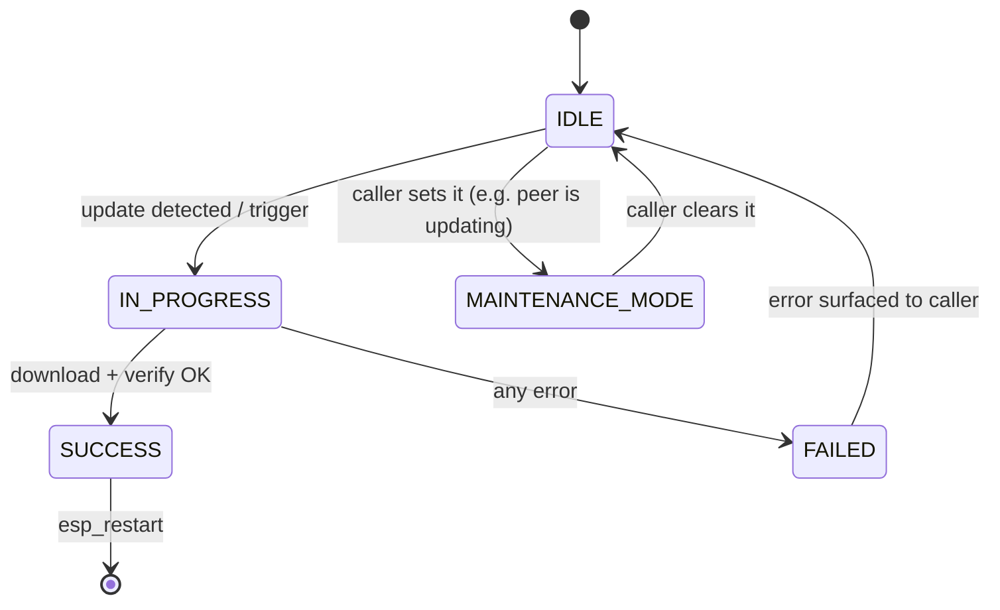
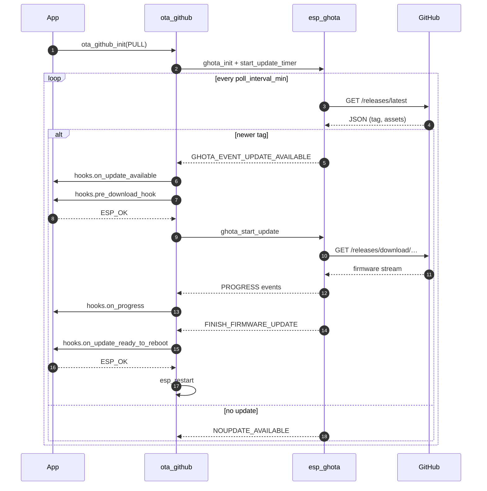
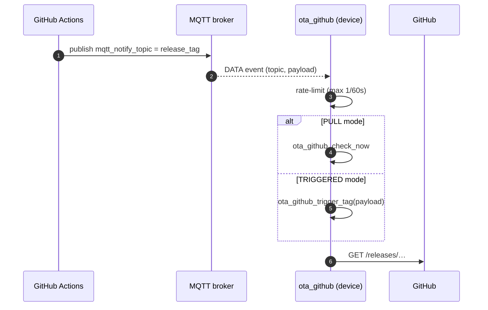
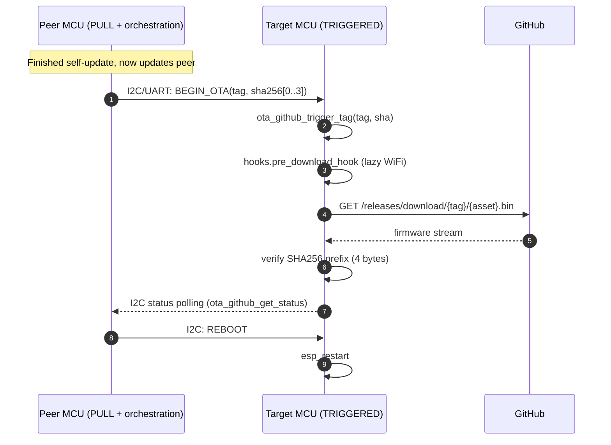
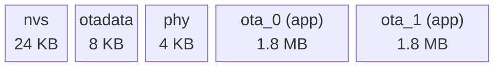

# `ota_github` architecture

This document explains the internal structure of the component. Read it if
you're debugging an update failure, tuning memory usage, or extending the
component with a new mode.

## Module layout

```
ota_github/
├── include/
│   ├── ota_github.h          ← public API
│   └── ota_github_events.h   ← esp_event bus declarations
└── src/
    ├── ota_github.c          ← init, state mutex, stability timer, API entry points
    ├── ota_github_pull.c     ← PULL mode: wraps esp_ghota's event stream
    ├── ota_github_direct.c   ← TRIGGERED mode: esp_https_ota worker task + SHA256
    ├── ota_github_mqtt.c     ← optional MQTT subscribe → check/trigger
    └── ota_github_internal.h ← private shared state
```

Each `.c` file owns a single concern. They communicate through the global
state in `g_ota_github` (mutex-guarded) and the public esp_event bus.

## State machine



Source: [diagrams/state-machine.mmd](diagrams/state-machine.mmd).

The `MAINTENANCE_MODE` status is not produced by the component itself — it's
reserved for callers (like the robocar main controller) that want to report
a "we're out of service while a peer updates us" state over the same
reporting API.

## PULL mode sequence



Source: [diagrams/sequence-pull.mmd](diagrams/sequence-pull.mmd).

## MQTT-notify sequence



Source: [diagrams/sequence-push.mmd](diagrams/sequence-push.mmd).

## TRIGGERED mode sequence (peer orchestration)



Source: [diagrams/sequence-triggered.mmd](diagrams/sequence-triggered.mmd).

## Partition contract

The component assumes a standard dual-OTA partition table. If your project
doesn't have one, copy [`partitions.csv`][robocar-partitions] from the
robocar reference:

```
# Name,   Type, SubType, Offset,   Size
nvs,      data, nvs,     0x9000,   0x6000
otadata,  data, ota,     0xF000,   0x2000
phy_init, data, phy,     0x11000,  0x1000
ota_0,    app,  ota_0,   0x12000,  0x1CD000
ota_1,    app,  ota_1,   0x1DF000, 0x1CD000
spiffs,   data, spiffs,  0x3AC000, 0x54000
```



Source: [diagrams/partitions.mmd](diagrams/partitions.mmd).

At any moment one partition is *active*, the other is *inactive*. OTA
writes to the inactive partition. On reboot the bootloader switches.
`ota_github_confirm_valid` (called automatically after the stability
timeout) tells the bootloader not to roll back.

**Binary size limit:** 1.8 MB — enforced in CI
(`_build-esp32-firmware.yml` fails the release build if exceeded).

## Tasks and memory

| Task | Stack | Priority | When alive |
|---|---|---|---|
| `ota_github_dl` | `cfg.task_stack_size` (default 8192) | `cfg.task_priority` (default 5) | During a TRIGGERED download; ends with `vTaskDelete` |
| esp_ghota internal | configured by esp_ghota | configured by esp_ghota | Always (PULL mode) |
| `ota_stability` (software timer) | FreeRTOS timer task | timer task priority | Always, for `stability_timeout_ms` after boot |

**RAM overhead** (approximate, ESP32, release build):

- `ota_github` itself: ~1 KB for `g_ota_github` + mutex + timer
- `esp_ghota` (PULL only): ~6 KB task stack + heap for release JSON parsing
- `esp_https_ota` during download: ~10 KB TLS context + 4 KB HTTP buffer
- Certificate bundle (flash, not RAM): ~50 KB

## Failure modes and error codes

`ota_github_get_error_code()` returns a small tag matching the codes in
[include/ota_github.h](../include/ota_github.h):

| Code | Meaning | Typical cause |
|---:|---|---|
| 0 | no error | — |
| 1 | internal | task creation / OOM |
| 2 | `pre_download_hook` failed | WiFi could not be brought up |
| 3 | `esp_https_ota_begin` failed | DNS / TLS / redirect / 404 |
| 4 | download or flash error | TCP reset, short read, flash-write error |
| 5 | `esp_https_ota_finish` failed | corrupt image |
| 6 | SHA256 prefix mismatch | tampered or wrong asset |

On code 6 the component additionally calls
`esp_ota_mark_app_invalid_rollback_and_reboot()` so the bootloader refuses
to run the bad image on the next reset.

## Thread-safety

- All status/progress getters take a 50 ms mutex — safe to call from any
  task including interrupt-level code via `xSemaphoreTakeFromISR` variants
  (not currently exposed; open an issue if you need it).
- Event handlers (ghota, mqtt) may run on separate tasks; they only touch
  state through the public helpers, which acquire the mutex.
- `ota_github_init` is NOT thread-safe — call it once during startup.

## Extending the component

The most common extensions live outside the component (hooks, events). If
you need a new mode (e.g. update from HTTP basic-auth server) the cleanest
approach is a new `ota_github_<mode>.c` that exposes `ota_github_<mode>_run`
and an enum value. Keep the public API stable.

[robocar-partitions]: ../../../esp32-projects/robocar-main/partitions.csv
