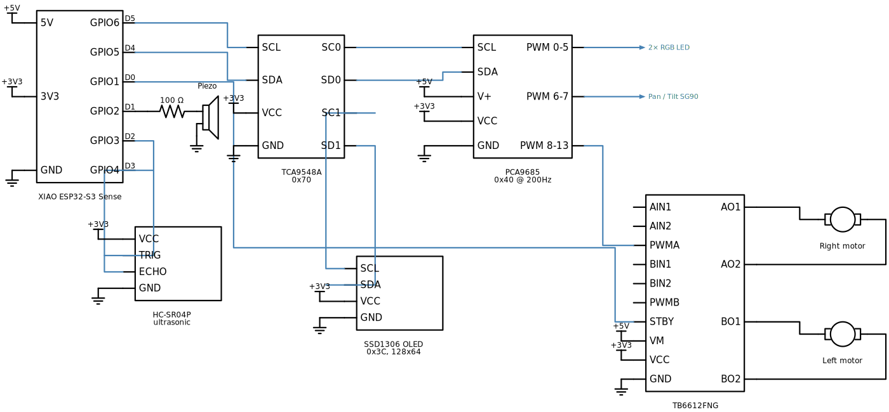
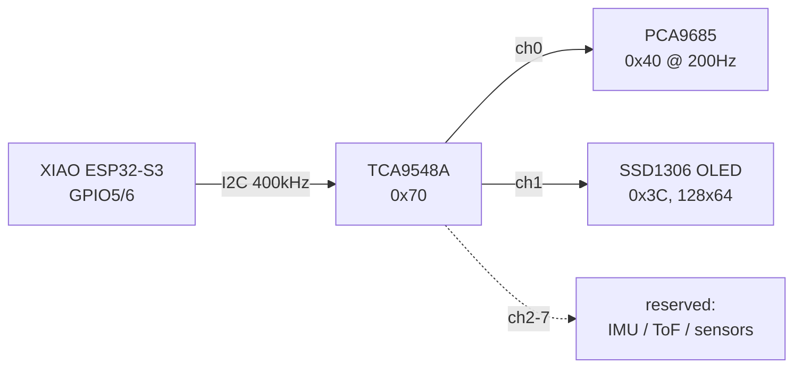
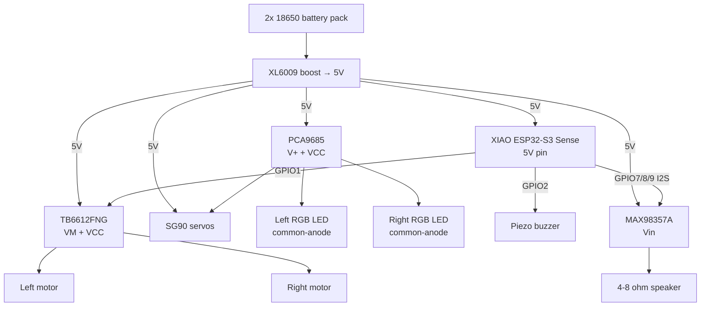
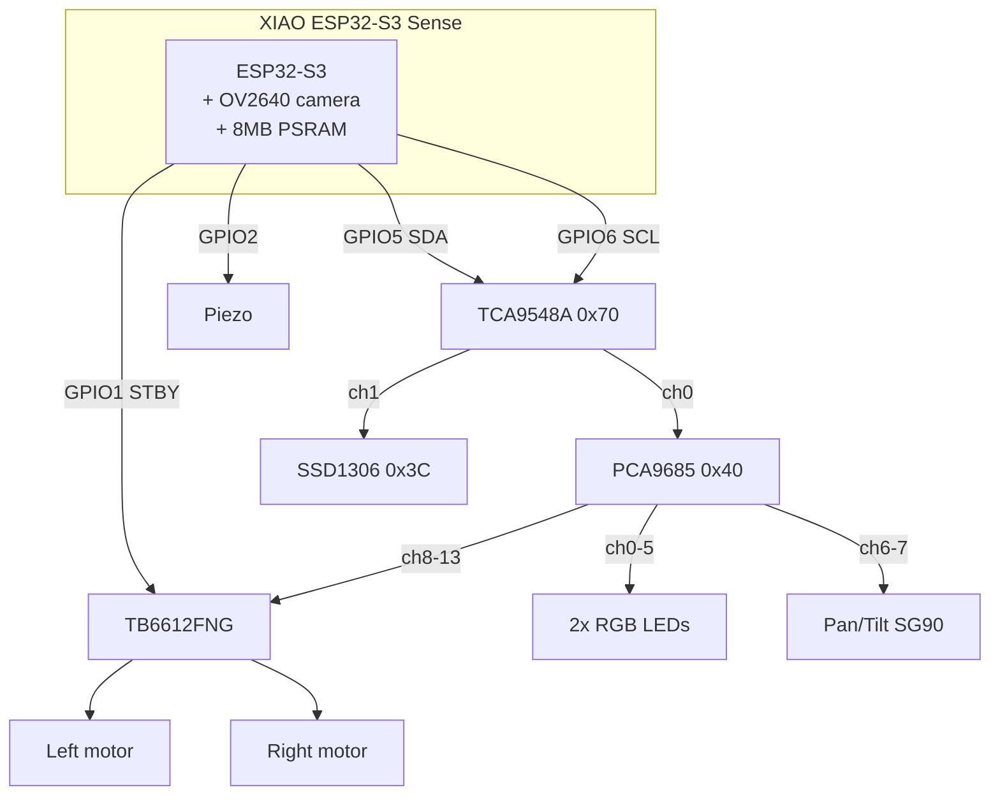

# Wiring — robocar-unified (XIAO ESP32-S3 Sense)

Single-board wiring for the consolidated robocar. All pin assignments are authoritative in [`main/pin_config.h`](main/pin_config.h); this document mirrors them for human reference.



Schematic source: [`docs/schematics/circuits/robocar_unified.py`](../../../docs/schematics/circuits/robocar_unified.py). Re-render with `just schematics::render-one robocar_unified` after pin changes.

**All components must share a common ground (GND).**

## GPIO assignments (XIAO ESP32-S3 Sense)

The XIAO exposes only 11 GPIOs on its headers. Camera pins are internal to the Sense module and do not conflict with header pins.

| XIAO Pin | GPIO | Function | Notes |
|----------|------|----------|-------|
| D0 | GPIO1 | TB6612FNG STBY | HIGH = motors enabled |
| D1 | GPIO2 | Piezo buzzer | LEDC PWM |
| D2 | GPIO3 | Ultrasonic TRIG | 10 µs pulse output |
| D3 | GPIO4 | Ultrasonic ECHO | Pulse width input (RMT RX) |
| D4 | GPIO5 | **I2C SDA** | to TCA9548A |
| D5 | GPIO6 | **I2C SCL** | to TCA9548A |
| D6 | GPIO43 | USB Serial TX | debug console |
| D7 | GPIO44 | USB Serial RX | debug console |
| D8 | GPIO7 | **I2S BCLK** | to MAX98357A BCLK |
| D9 | GPIO8 | **I2S LRCLK** | to MAX98357A LRC |
| D10 | GPIO9 | **I2S DIN** | to MAX98357A DIN |

> **The GPIO budget is fully allocated.** There are no spare header pins left.
> Additional digital I/O must go through the MCP23017 on TCA9548A channel 2.

I2C runs at **400 kHz**.

## I2C topology (TCA9548A multiplexer @ 0x70)



## PCA9685 channel map (0x40, 200 Hz)

| Ch | Signal | Device |
|----|--------|--------|
| 0 | Left LED R | RGB LED (left) |
| 1 | Left LED G | |
| 2 | Left LED B | |
| 3 | Right LED R | RGB LED (right) |
| 4 | Right LED G | |
| 5 | Right LED B | |
| 6 | Pan PWM | SG90 servo |
| 7 | Tilt PWM | SG90 servo |
| 8 | Motor R IN1 | TB6612FNG (digital: 0 / 4096) |
| 9 | Motor R IN2 | TB6612FNG (digital) |
| 10 | Motor R PWM | TB6612FNG (PWM 0-4095) |
| 11 | Motor L IN1 | TB6612FNG (digital) |
| 12 | Motor L IN2 | TB6612FNG (digital) |
| 13 | Motor L PWM | TB6612FNG (PWM 0-4095) |
| 14-15 | *reserved* | |

200 Hz is a compromise between servo timing (ideal 50 Hz) and motor PWM smoothness — works well for SG90s and TB6612FNG.

## Power



**Common ground required across all components.**

### Amplifier supply — read before wiring

`CONFIG_ESP_BROWNOUT_DET` is **already disabled** in this project because motor
inrush was tripping it. The MAX98357A adds transient draw of up to ~1 A into a
4 Ω load, on the same rail, at moments uncorrelated with motor current. With
brownout detection off, an undersized rail will not warn you — it will present
as random resets or corrupt audio mid-sentence.

- Fit a **bulk capacitor (≥ 470 µF) at the amplifier's Vin**, plus the usual
  0.1 µF close to the pin.
- Prefer a **separate 5 V feed from the boost converter** to the amplifier
  rather than daisy-chaining off the motor-driver rail.
- An **8 Ω speaker roughly halves peak current** versus 4 Ω and is the safer
  first choice while validating the supply.

## Audio output (MAX98357A)

Mono I2S class-D amplifier providing the robot's voice. Audio is 24 kHz 16-bit
mono — the native output rate of the Gemini TTS model, carried through without
resampling.

| Signal | Pin | Function |
|--------|-----|----------|
| BCLK | GPIO7 (D8) | Bit clock |
| LRC | GPIO8 (D9) | Word select / left-right clock |
| DIN | GPIO9 (D10) | Serial audio data |
| Vin | 5 V | See supply note above |
| GND | any GND | Shared ground |
| SD_MODE | *(see below)* | Channel select / shutdown |
| GAIN | float | 9 dB default; tie to GND for 12 dB, Vin for 6 dB |

`SD_MODE` selects the channel: leave **floating** for (L+R)/2 — correct here,
since the firmware duplicates the mono sample into both slots. Tying it to GND
shuts the amplifier down.

> **Trade-off: this replaces the microSD slot.** On the Sense expansion board
> D8/D9/D10 are the microSD SPI bus. Wiring the amplifier here gives up the
> card reader permanently. There is no alternative — I2S needs a hardware
> peripheral, so it cannot be moved behind the PCA9685 or the MCP23017.

The I2S channel is disabled between utterances: the MAX98357A hisses faintly
whenever BCLK is running, so leaving it clocking silence is audible.

## Ultrasonic rangefinder

A 3.3 V-compatible ultrasonic sensor (HC-SR04P, RCWL-1601, or US-100) provides distance readings for the reactive controller's obstacle reflex.

| Signal | Pin | Voltage | Function |
|--------|-----|---------|----------|
| TRIG | GPIO3 (D2) | 3.3 V | Output; 10 µs pulse triggers measurement |
| ECHO | GPIO4 (D3) | 3.3 V | Input; pulse width encodes distance (RMT RX) |
| VCC | 3.3 V | 3.3 V | **Must be 3.3 V variant** (HC-SR04P, not HC-SR04) |
| GND | any GND | – | shared ground |

The sensor samples at ~20 Hz. Obstacle reflex: if distance < 15 cm, the executor immediately stops and reverses, independent of planner goals. The specific module will be confirmed on first wiring; update this table if a different 3.3 V sensor is used.

## Full connection diagram



## Flashing

XIAO ESP32-S3 has native USB-Serial-JTAG (VID `0x303a`). Plug in USB-C and flash:

```bash
PORT=/dev/cu.usbmodem* just robocar-unified::flash
```

If the board won't enter download mode: hold **BOOT**, tap **RESET**, release BOOT. See [README.md](README.md) for full flash / monitor commands.
