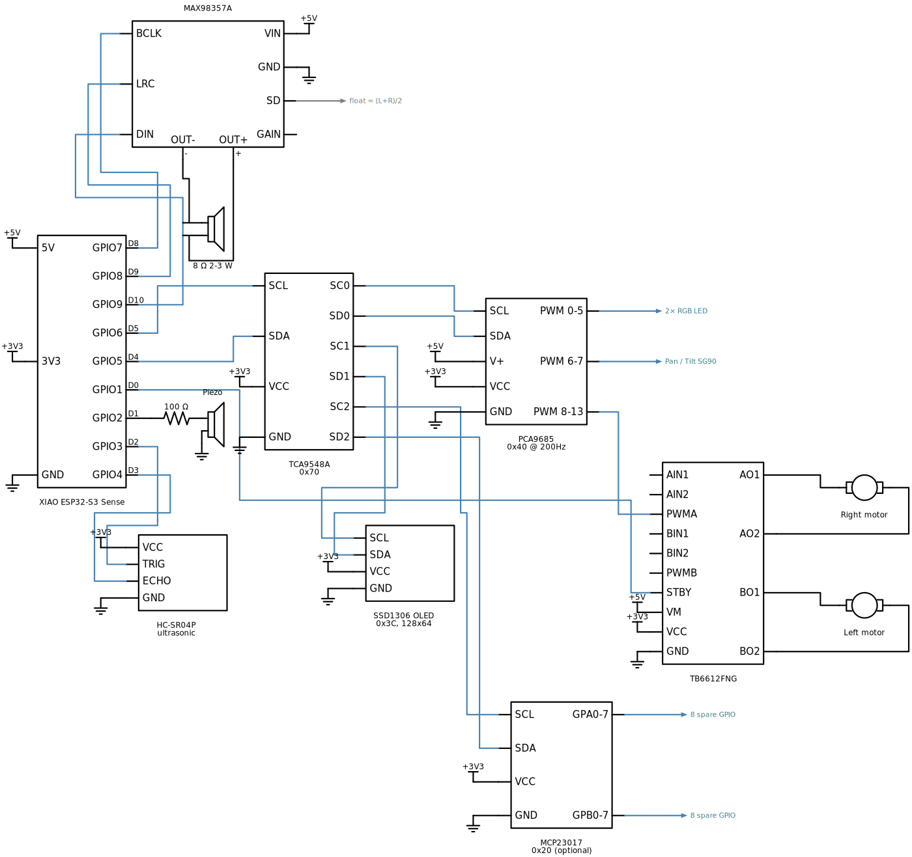
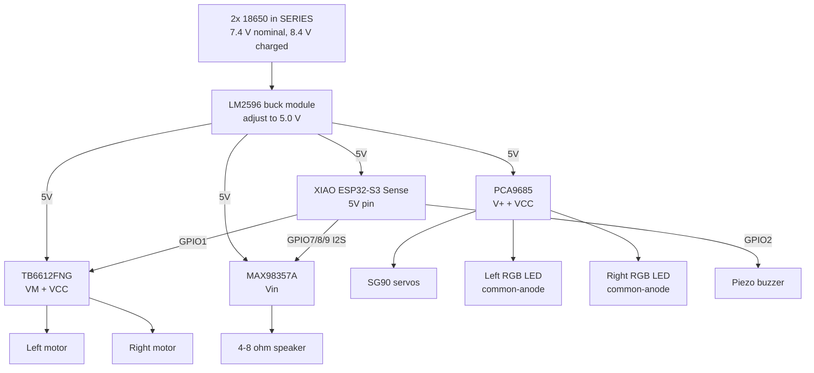

# Wiring — robocar-unified (XIAO ESP32-S3 Sense)

Single-board wiring for the consolidated robocar. All pin assignments are authoritative in [`main/pin_config.h`](main/pin_config.h); this document mirrors them for human reference.



Schematic source: [`docs/schematics/circuits/robocar_unified.py`](../../../docs/schematics/circuits/robocar_unified.py). Re-render with `just schematics::render-one robocar_unified` after pin changes.

**All components must share a common ground (GND).**

## GPIO assignments (XIAO ESP32-S3 Sense)

The XIAO exposes only 11 GPIOs on its headers. Camera pins are internal to the Sense module and do not conflict with header pins.

| XIAO Pin | GPIO | Function | Notes |
|----------|------|----------|-------|
| D0 | GPIO1 | TB6612FNG STBY | HIGH = motors enabled |
| D1 | GPIO2 | Piezo buzzer | LEDC PWM |
| D2 | GPIO3 | Ultrasonic TRIG | 10 µs pulse output |
| D3 | GPIO4 | Ultrasonic ECHO | Pulse width input (RMT RX) |
| D4 | GPIO5 | **I2C SDA** | to TCA9548A |
| D5 | GPIO6 | **I2C SCL** | to TCA9548A |
| D6 | GPIO43 | USB Serial TX | debug console |
| D7 | GPIO44 | USB Serial RX | debug console |
| D8 | GPIO7 | **I2S BCLK** | to MAX98357A BCLK |
| D9 | GPIO8 | **I2S LRCLK** | to MAX98357A LRC |
| D10 | GPIO9 | **I2S DIN** | to MAX98357A DIN |

> **The GPIO budget is fully allocated.** There are no spare header pins left.
> Additional digital I/O must go through the MCP23017 on TCA9548A channel 2.

I2C runs at **400 kHz**.

## I2C topology (TCA9548A multiplexer @ 0x70)

Select the channel on the multiplexer **before** addressing any downstream
device — nothing talks to the primary bus directly.

| Channel | Device | Address |
|---------|--------|---------|
| ch0 | PCA9685 PWM driver (motors, servos, LEDs) | 0x40 @ 200 Hz |
| ch1 | SSD1306 OLED display (128x64) | 0x3C |
| ch2 | MCP23017 GPIO expander — **optional**, firmware boots without it | 0x20 |
| ch3-7 | *reserved* (IMU / ToF / future sensors) | — |

## PCA9685 channel map (0x40, 200 Hz)

| Ch | Signal | Device |
|----|--------|--------|
| 0 | Left LED R | RGB LED (left) |
| 1 | Left LED G | |
| 2 | Left LED B | |
| 3 | Right LED R | RGB LED (right) |
| 4 | Right LED G | |
| 5 | Right LED B | |
| 6 | Pan PWM | SG90 servo |
| 7 | Tilt PWM | SG90 servo |
| 8 | Motor R PWM | TB6612FNG **PWMA** (PWM 0-4095) |
| 9 | Motor R IN2 | TB6612FNG **AIN2** (digital: 0 / 4096) |
| 10 | Motor R IN1 | TB6612FNG **AIN1** (digital) |
| 11 | Motor L IN1 | TB6612FNG **BIN1** (digital) |
| 12 | Motor L IN2 | TB6612FNG **BIN2** (digital) |
| 13 | Motor L PWM | TB6612FNG **PWMB** (PWM 0-4095) |
| 14-15 | *reserved* | |

200 Hz is a compromise between servo timing (ideal 50 Hz) and motor PWM smoothness — works well for SG90s and TB6612FNG.

**Channels 8-13 are in the motor driver's own pin order, not in a per-motor
order.** Read the TB6612FNG's control header top to bottom and it is PWMA,
AIN2, AIN1, STBY, BIN1, BIN2, PWMB — symmetric about STBY rather than repeated
— so following it makes the six jumpers run straight across with no crossings,
at the cost of the A side reading PWM-then-direction and the B side
direction-then-PWM. STBY is skipped here because it comes from GPIO1, not from
the PCA9685. `docs/wiring-card-motors.pdf` draws both boards; `main/pin_config.h`
is authoritative, and `set_motors()` places each value by channel rather than by
position so this ordering cannot silently mis-drive a pin.

## Power


```mermaid
graph TD
    Bat[2x 18650 in SERIES<br/>7.4 V nominal, 8.4 V charged] --> Buck[LM2596 buck module<br/>adjust to 5.0 V]
    Buck -->|5V| XIAO[XIAO ESP32-S3 Sense<br/>5V pin]
    Buck -->|5V| MD[TB6612FNG<br/>VM + VCC]
    Buck -->|5V| PCA[PCA9685<br/>V+ + VCC]
    Buck -->|5V| AMP[MAX98357A<br/>Vin]
    PCA --> Servos[SG90 servos]
    MD --> ML[Left motor]
    MD --> MR[Right motor]
    PCA --> LED_L[Left RGB LED<br/>common-anode]
    PCA --> LED_R[Right RGB LED<br/>common-anode]
    XIAO -->|GPIO2| Piezo[Piezo buzzer]
    XIAO -->|GPIO1| MD
    XIAO -->|GPIO7/8/9 I2S| AMP
    AMP --> SPK[4-8 ohm speaker]
    classDef gnd fill:#ccc,stroke:#333
```

**Common ground required across all components.**

### The regulator is a step-DOWN converter, and its output is adjustable

The pack is **two 18650 cells in series** — 7.4 V nominal, 8.4 V fully charged —
regulated to 5 V by an **LM2596 buck module**. Series and buck go together: a
step-down converter needs its input above its output, so a parallel (3.7 V) pack
could not feed it.

The common LM2596 module is the **adjustable** variant with a multi-turn
trimpot, so it does not produce 5 V until somebody sets it there.

- **Set the output before connecting anything to it.** Power the module from the
  pack with its output unloaded, and adjust to **5.0 V** on a meter. It can be
  turned anywhere from 1.2 V to 37 V.
- **5.5 V is the ceiling that matters.** The MAX98357A's recommended maximum
  supply is 5.5 V (absolute maximum 6 V), and this rail also feeds the XIAO's
  5V pin into its onboard regulator. A trimpot left high damages parts; a
  trimpot left low gives weak servos and a clipping amplifier.

### The 5 V rail dies before the cells do

The LM2596 needs its input roughly **1.25 V above its output at 3 A**, and about
**0.95 V above at 1 A** (TI SNVS124G, Figure 7-6). At 5 V out that puts the
dropout point near **6.3 V of pack under heavy load** — about 3.15 V per cell,
which a 2S 18650 pack reaches while it still has usable charge left.

So the failure is not a clean shutdown. As the pack sags the 5 V rail follows it
down, and because `CONFIG_ESP_BROWNOUT_DET` is disabled (see below) nothing
announces it: the symptoms are weak or stalled servos, clipping or distorted
audio, and eventually random resets. **A distorted voice is a plausible
low-battery indication on this robot.** Measure the pack before diagnosing
anything else on this rail.

### Star-wire the rail; do not daisy-chain

Every load in the diagram takes its own feed from the regulator's output
terminal. This is load-bearing rather than tidiness: a servo's inrush flowing
through the amplifier's feed wire modulates the amplifier's local supply, which
is heard as distortion. The motor driver, the PCA9685/servos and the amplifier
are the three transient sources, and none of them should share a run.

### Amplifier supply — read before wiring

`CONFIG_ESP_BROWNOUT_DET` is **already disabled** in this project because motor
inrush was tripping it. The MAX98357A adds transient draw of up to ~1 A into a
4 Ω load, on the same rail, at moments uncorrelated with motor current. With
brownout detection off, an undersized rail will not warn you — it will present
as random resets or corrupt audio mid-sentence.

- Fit a **bulk capacitor (≥ 470 µF) at the amplifier's Vin**, plus the usual
  0.1 µF close to the pin. Fit the same at the PCA9685's **V+**: the servos are
  the harsher transient source of the two.
- **Never power servos from the XIAO's 5V pin or from USB VBUS.** That pin is a
  regulator input, not a supply output, and a USB host port cannot source what
  two SG90s and a class-D amplifier draw. Servos that buzz without moving are
  the signature.
- An **8 Ω speaker roughly halves peak current** versus 4 Ω and is the safer
  first choice while validating the supply.

### Powering from the regulator with USB also connected

Both at once is the normal bench case — USB for the console, the pack for the
motors. Whether it is safe depends on whether the XIAO's 5V pad is isolated from
USB VBUS by a series diode, which **is worth measuring rather than assuming**:
with USB alone connected and the regulator off, read the 5V pad against GND.
Roughly 5.0 V means it is tied straight to VBUS and feeding the rail would
back-feed the host port; roughly 4.6–4.7 V means a diode is in the way and the
higher source simply wins.

The arrangement that avoids the question entirely, and the better one for
debugging anyway: **regulator → amplifier, PCA9685 and motor driver; USB → the
XIAO; grounds commoned.** The MCU then sits on a rail that servo and motor
inrush cannot sag.

Do not connect anything to the XIAO's BAT pads while feeding its 5V pin — the
onboard charger will try to charge whatever it finds there.

## Audio output (MAX98357A)

Mono I2S class-D amplifier providing the robot's voice. Audio is 24 kHz 16-bit
mono — the native output rate of the Gemini TTS model, carried through without
resampling.

| Signal | Pin | Function |
|--------|-----|----------|
| BCLK | GPIO7 (D8) | Bit clock |
| LRC | GPIO8 (D9) | Word select / left-right clock |
| DIN | GPIO9 (D10) | Serial audio data |
| Vin | 5 V | See supply note above |
| GND | any GND | Shared ground |
| SD_MODE | *(see below)* | Channel select / shutdown |
| GAIN | float | 9 dB default; tie to GND for 12 dB, Vin for 6 dB |

`SD_MODE` selects the channel: leave **floating** for (L+R)/2 — correct here,
since the firmware duplicates the mono sample into both slots. Tying it to GND
shuts the amplifier down.

> **Trade-off: this replaces the microSD slot.** On the Sense expansion board
> D8/D9/D10 are the microSD SPI bus. Wiring the amplifier here gives up the
> card reader permanently. There is no alternative — I2S needs a hardware
> peripheral, so it cannot be moved behind the PCA9685 or the MCP23017.

The I2S channel is disabled between utterances: the MAX98357A hisses faintly
whenever BCLK is running, so leaving it clocking silence is audible.

## Onboard microphone (PDM)

The Sense expansion board carries an MSM261D PDM microphone wired to the
ESP32-S3 directly. **Nothing to wire** — it is on the module — but it is live
hardware the firmware depends on, so it is recorded here.

| Signal | GPIO | Direction | Function |
|--------|------|-----------|----------|
| PDM CLK | GPIO42 | output | Clock, driven by the ESP32-S3 |
| PDM DATA | GPIO41 | input | Serial PDM data |

16 kHz / 16-bit / mono — fixed by the microphone, and also what Gemini expects
for inline audio, so there is no resampling stage anywhere in the path. Neither
pin collides with the camera DVP group (GPIO10-18, 38-40, 47-48) or the D0-D10
headers (GPIO1-9, 43-44).

It feeds two features: the ambient-audio speech gate ([ADR-020](../../docs/decisions/ADR-020-ambient-audio-speech-gate.md)),
and the push-to-talk `listen` console command. On the ESP32-S3, PDM RX exists
only on I2S0 — the same controller the MAX98357A uses — but the RX channel
**must** be allocated in its own `i2s_new_channel()` call, or the driver goes
full-duplex and clocks the 16 kHz microphone off the 24 kHz amplifier. See the
comment at the allocation site in `main/mic_pdm.c`.

Use the `mic` console command to tell a dead microphone from a quiet room.

## Ultrasonic rangefinder

A 3.3 V-compatible ultrasonic sensor (HC-SR04P, RCWL-1601, or US-100) provides distance readings for the reactive controller's obstacle reflex.

| Signal | Pin | Voltage | Function |
|--------|-----|---------|----------|
| TRIG | GPIO3 (D2) | 3.3 V | Output; 10 µs pulse triggers measurement |
| ECHO | GPIO4 (D3) | 3.3 V | Input; pulse width encodes distance (RMT RX) |
| VCC | 3.3 V | 3.3 V | **Must be 3.3 V variant** (HC-SR04P, not HC-SR04) |
| GND | any GND | – | shared ground |

The sensor samples at ~20 Hz. Obstacle reflex: if distance < 15 cm, the executor immediately stops and reverses, independent of planner goals. The specific module will be confirmed on first wiring; update this table if a different 3.3 V sensor is used.

## Flashing

XIAO ESP32-S3 has native USB-Serial-JTAG (VID `0x303a`). Plug in USB-C and flash:

```bash
PORT=/dev/cu.usbmodem* just robocar-unified::flash
```

If the board won't enter download mode: hold **BOOT**, tap **RESET**, release BOOT. See [README.md](README.md) for full flash / monitor commands.
