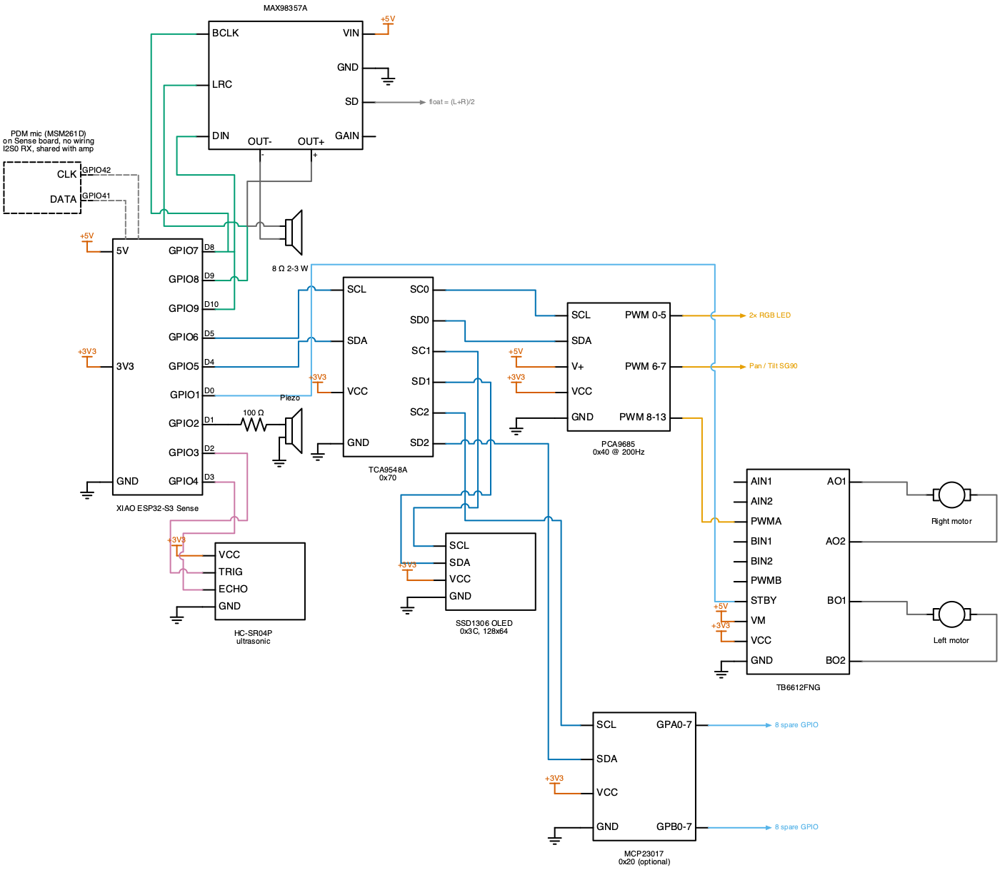
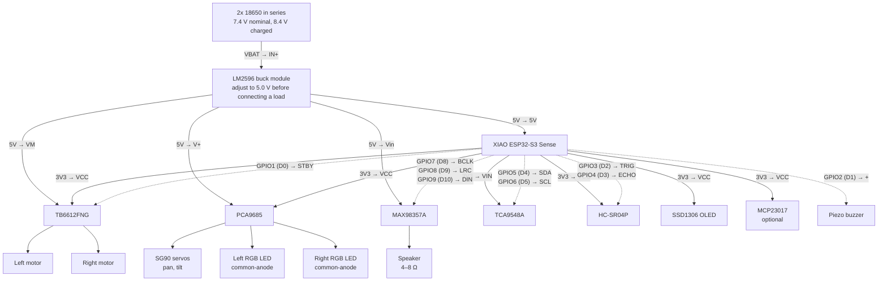

# Wiring — robocar-unified (XIAO ESP32-S3 Sense)

Single-board wiring for the consolidated robocar. All pin assignments are authoritative in [`main/pin_config.h`](main/pin_config.h); this document mirrors them for human reference. The pin tables and the power diagram marked `GENERATED` are emitted from [`hardware.toml`](hardware.toml), the header and the board reference by `just hardware::gen` (ADR-021), and CI fails when they are stale — change those sources, not the tables.



Schematic source: [`docs/schematics/circuits/robocar_unified.py`](../../../docs/schematics/circuits/robocar_unified.py). Re-render with `just schematics::render-one robocar_unified` after pin changes.

**All components must share a common ground (GND).**

## GPIO assignments (XIAO ESP32-S3 Sense)

The XIAO exposes only 11 GPIOs on its headers. Camera pins are internal to the Sense module and do not conflict with header pins.

<!-- BEGIN GENERATED: pin-table -->
<!-- Generated from hardware.toml, main/pin_config.h and the board reference by `just hardware::gen` — edit those, not this block. -->

| Pin | GPIO | Macro | Wired to | Notes |
|-----|------|-------|----------|-------|
| D0 | GPIO1 | `MOTOR_STBY_PIN` | TB6612FNG STBY | HIGH = motors enabled; the six control lines come from the PCA9685 |
| D1 | GPIO2 | `PIEZO_PIN` | Piezo buzzer + | LEDC PWM, through a series resistor; the other leg to GND |
| D2 | GPIO3 | `ULTRASONIC_TRIG_PIN` | HC-SR04P TRIG | 3.3 V output; a 10 µs pulse triggers a measurement |
| D3 | GPIO4 | `ULTRASONIC_ECHO_PIN` | HC-SR04P ECHO | 3.3 V input; pulse width encodes distance (RMT RX) |
| D4 | GPIO5 | `I2C_SDA_PIN` | TCA9548A SDA | Every I2C device sits behind the mux |
| D5 | GPIO6 | `I2C_SCL_PIN` | TCA9548A SCL |  |
| D6 | GPIO43 | `UART0_TX_PIN` | — | UART0 TX, spare: the serial console is USB-Serial-JTAG on the USB-C connector, not this pad. The ROM bootloader prints its boot log here at every reset |
| D7 | GPIO44 | `UART0_RX_PIN` | — | UART0 RX, spare: the serial console is USB-Serial-JTAG on the USB-C connector, not this pad |
| D8 | GPIO7 | `I2S_BCLK_PIN` | MAX98357A BCLK | Bit clock |
| D9 | GPIO8 | `I2S_LRCLK_PIN` | MAX98357A LRC | Word select / left-right clock |
| D10 | GPIO9 | `I2S_DIN_PIN` | MAX98357A DIN | Serial audio data |

<!-- END GENERATED -->

> **Two spare pads: D6/D7 (GPIO43/44, UART0).** Nothing uses them. The ROM
> bootloader prints its boot log on GPIO43 at every reset, so anything wired to
> D6 sees that traffic. Beyond those two, digital I/O goes through the MCP23017
> on TCA9548A channel 2.

I2C runs at **400 kHz**.

## I2C topology (TCA9548A multiplexer @ 0x70)

Select the channel on the multiplexer **before** addressing any downstream
device — nothing talks to the primary bus directly.

| Channel | Device | Address |
|---------|--------|---------|
| ch0 | PCA9685 PWM driver (motors, servos, LEDs) | 0x40 @ 100 Hz |
| ch1 | SSD1306 OLED display (128x64) | 0x3C |
| ch2 | MCP23017 GPIO expander — **optional**, firmware boots without it | 0x20 |
| ch3-7 | *reserved* (IMU / ToF / future sensors) | — |

## PCA9685 channel map (0x40, 100 Hz)

| Ch | Signal | Device |
|----|--------|--------|
| 0 | Left LED R | RGB LED (left) |
| 1 | Left LED G | |
| 2 | Left LED B | |
| 3 | Right LED R | RGB LED (right) |
| 4 | Right LED G | |
| 5 | Right LED B | |
| 6 | Pan PWM | SG90 servo |
| 7 | Tilt PWM | SG90 servo |
| 8 | Motor R PWM | TB6612FNG **PWMA** (PWM 0-4095) |
| 9 | Motor R IN2 | TB6612FNG **AIN2** (digital: 0 / 4096) |
| 10 | Motor R IN1 | TB6612FNG **AIN1** (digital) |
| 11 | Motor L IN1 | TB6612FNG **BIN1** (digital) |
| 12 | Motor L IN2 | TB6612FNG **BIN2** (digital) |
| 13 | Motor L PWM | TB6612FNG **PWMB** (PWM 0-4095) |
| 14-15 | *reserved* | |

100 Hz is a chip-wide compromise — one prescaler serves the servos, the motors and the LEDs. Measured on this build (2026-09-18): the SG90s fitted track at 50, 100 and 125 Hz and **buzz at 200**, stalling against the pulse train instead of following it. 100 sits one rung below the highest rate that worked, because the bench test was unloaded and a loaded servo has less timing margin. `servo freq <hz>` retunes it live without a reflash.

**Channels 8-13 are in the motor driver's own pin order, not in a per-motor
order.** Read the TB6612FNG's control header top to bottom and it is PWMA,
AIN2, AIN1, STBY, BIN1, BIN2, PWMB — symmetric about STBY rather than repeated
— so following it makes the six jumpers run straight across with no crossings,
at the cost of the A side reading PWM-then-direction and the B side
direction-then-PWM. STBY is skipped here because it comes from GPIO1, not from
the PCA9685. `docs/wiring-card-motors.pdf` draws both boards; `main/pin_config.h`
is authoritative, and `set_motors()` places each value by channel rather than by
position so this ordering cannot silently mis-drive a pin.

## Power

Solid edges are supply rails, labelled with the rail and the pin it lands on;
dotted edges are the XIAO's signal nets, each with its GPIO and header pad;
unlabelled edges are loads a part drives from its own terminals. The diagram is
emitted from the `[[rails]]`, `[[nets]]` and `[[outputs]]` in
[`hardware.toml`](hardware.toml), so a pin or rail changed there or in
`main/pin_config.h` reaches it through `just hardware::gen`.

<!-- BEGIN GENERATED: power-diagram -->
<!-- Generated from hardware.toml, main/pin_config.h and the board reference by `just hardware::gen` — edit those, not this block. -->


```mermaid
graph TD
    pack["2x 18650 in series<br/>7.4 V nominal, 8.4 V charged"]
    buck["LM2596 buck module<br/>adjust to 5.0 V before connecting a load"]
    mcu["XIAO ESP32-S3 Sense"]
    motor_driver["TB6612FNG"]
    pwm["PCA9685"]
    amp["MAX98357A"]
    mux["TCA9548A"]
    ranger["HC-SR04P"]
    oled["SSD1306 OLED"]
    expander["MCP23017<br/>optional"]
    buzzer["Piezo buzzer"]
    servos["SG90 servos<br/>pan, tilt"]
    led_left["Left RGB LED<br/>common-anode"]
    led_right["Right RGB LED<br/>common-anode"]
    motor_left["Left motor"]
    motor_right["Right motor"]
    speaker["Speaker<br/>4–8 Ω"]
    pack -->|"VBAT → IN+"| buck
    buck -->|"5V → 5V"| mcu
    buck -->|"5V → VM"| motor_driver
    buck -->|"5V → V+"| pwm
    buck -->|"5V → Vin"| amp
    mcu -->|"3V3 → VCC"| motor_driver
    mcu -->|"3V3 → VCC"| pwm
    mcu -->|"3V3 → VIN"| mux
    mcu -->|"3V3 → VCC"| ranger
    mcu -->|"3V3 → VCC"| oled
    mcu -->|"3V3 → VCC"| expander
    mcu -.->|"GPIO5 (D4) → SDA<br/>GPIO6 (D5) → SCL"| mux
    mcu -.->|"GPIO1 (D0) → STBY"| motor_driver
    mcu -.->|"GPIO3 (D2) → TRIG<br/>GPIO4 (D3) → ECHO"| ranger
    mcu -.->|"GPIO2 (D1) → +"| buzzer
    mcu -.->|"GPIO7 (D8) → BCLK<br/>GPIO8 (D9) → LRC<br/>GPIO9 (D10) → DIN"| amp
    pwm --> servos
    pwm --> led_left
    pwm --> led_right
    motor_driver --> motor_left
    motor_driver --> motor_right
    amp --> speaker
```

<!-- END GENERATED -->

**Common ground required across all components.**

### Logic rails are 3.3 V, not 5 V

The TB6612FNG's **VCC** and the PCA9685's **VCC** are logic supplies and take
**3.3 V**; only the TB6612FNG's **VM** and the PCA9685's **V+** take 5 V. This
diagram fed 5 V to both VCC pins until 2026-09; that was wrong, and the
arithmetic is not close:

| Part | Threshold | At V_CC = 5 V | At V_CC = 3.3 V |
|---|---|---|---|
| PCA9685 SCL/SDA | V_IH = 0.7 x V_DD | 3.5 V — above what the XIAO's 3.3 V I2C can drive | 2.31 V |
| TB6612FNG IN1/IN2/PWM | V_IH = 0.7 x V_CC | 3.5 V — above what the PCA9685 would output | 2.31 V |
| TB6612FNG STBY | V_IH = 0.7 x V_CC | 3.5 V — a 3.3 V GPIO cannot reliably lift it, so the motors stay in standby | 2.31 V |

Both parts specify their input threshold as a fraction of *their own* supply, so
the rail is not a free choice. `docs/wiring-card-motors.typ` and
`docs/schematics/circuits/robocar_unified.py` carry the same 3.3 V assignment.

**Check before power-up:** continuity between TB6612FNG VM and TB6612FNG VCC
must read open. A beep means the 5 V and 3.3 V rails are shorted.

### The regulator is a step-DOWN converter, and its output is adjustable

The pack is **two 18650 cells in series** — 7.4 V nominal, 8.4 V fully charged —
regulated to 5 V by an **LM2596 buck module**. Series and buck go together: a
step-down converter needs its input above its output, so a parallel (3.7 V) pack
could not feed it.

The common LM2596 module is the **adjustable** variant with a multi-turn
trimpot, so it does not produce 5 V until somebody sets it there.

- **Set the output before connecting anything to it.** Power the module from the
  pack with its output unloaded, and adjust to **5.0 V** on a meter. It can be
  turned anywhere from 1.2 V to 37 V.
- **5.5 V is the ceiling that matters.** The MAX98357A's recommended maximum
  supply is 5.5 V (absolute maximum 6 V), and this rail also feeds the XIAO's
  5V pin into its onboard regulator. A trimpot left high damages parts; a
  trimpot left low gives weak servos and a clipping amplifier.

### The 5 V rail dies before the cells do

The LM2596 needs its input roughly **1.25 V above its output at 3 A**, and about
**0.95 V above at 1 A** (TI SNVS124G, Figure 7-6). At 5 V out that puts the
dropout point near **6.3 V of pack under heavy load** — about 3.15 V per cell,
which a 2S 18650 pack reaches while it still has usable charge left.

So the failure is not a clean shutdown. As the pack sags the 5 V rail follows it
down, and because `CONFIG_ESP_BROWNOUT_DET` is disabled (see below) nothing
announces it: the symptoms are weak or stalled servos, clipping or distorted
audio, and eventually random resets. **A distorted voice is a plausible
low-battery indication on this robot.** Measure the pack before diagnosing
anything else on this rail.

### Star-wire the rail; do not daisy-chain

Every 5V load in the diagram takes its own feed from the regulator's output
terminal. This is load-bearing rather than tidiness: a servo's inrush flowing
through the amplifier's feed wire modulates the amplifier's local supply, which
is heard as distortion. The motor driver, the PCA9685/servos and the amplifier
are the three transient sources, and none of them should share a run.

### Amplifier supply — read before wiring

`CONFIG_ESP_BROWNOUT_DET` is **already disabled** in this project because motor
inrush was tripping it. The MAX98357A adds transient draw of up to ~1 A into a
4 Ω load, on the same rail, at moments uncorrelated with motor current. With
brownout detection off, an undersized rail will not warn you — it will present
as random resets or corrupt audio mid-sentence.

- Fit a **bulk capacitor (470 µF) at the amplifier's Vin** — C3 below. The
  breakout already carries the datasheet's 0.1 µF + 10 µF next to the chip, so
  nothing smaller is needed there. Fit the same at the PCA9685's **V+** (C1):
  the servos are the harsher transient source of the two.
- **Never power servos from the XIAO's 5V pin or from USB VBUS.** That pin is a
  regulator input, not a supply output, and a USB host port cannot source what
  two SG90s and a class-D amplifier draw. Servos that buzz without moving are
  the signature.
- An **8 Ω speaker roughly halves peak current** versus 4 Ω and is the safer
  first choice while validating the supply.

### Powering from the regulator with USB also connected

Both at once is the normal bench case — USB for the console, the pack for the
motors. Whether it is safe depends on whether the XIAO's 5V pad is isolated from
USB VBUS by a series diode, which **is worth measuring rather than assuming**:
with USB alone connected and the regulator off, read the 5V pad against GND.
Roughly 5.0 V means it is tied straight to VBUS and feeding the rail would
back-feed the host port; roughly 4.6–4.7 V means a diode is in the way and the
higher source simply wins.

The arrangement that avoids the question entirely, and the better one for
debugging anyway: **regulator → amplifier, PCA9685 and motor driver; USB → the
XIAO; grounds commoned.** The MCU then sits on a rail that servo and motor
inrush cannot sag.

Do not connect anything to the XIAO's BAT pads while feeding its 5V pin — the
onboard charger will try to charge whatever it finds there.

### Suggested capacitors

The schematic draws six capacitors that no breakout carries, labelled C1–C6.
C1–C3 are recommended; C4–C6 are optional. Each was chosen by reading what the
vendor's board file already fits (the Eagle file at the commit its
`docs/reference/boards/` page cites) against what the part's datasheet asks for.

| Ref | Part | Fit at | Status | Why, and the source |
|-----|------|--------|--------|---------------------|
| C1 | 470 µF electrolytic, 16 V | PCA9685 V+ | Recommended | The Adafruit board leaves a through-hole electrolytic footprint on the V+ net empty for the builder (vendor ref C2, 3.5 mm pitch). Adafruit's guide suggests n × 100 µF for n servos as a start — 200 µF for the two SG90s — and says the right value depends on the servos and the supply; 470 µF matches C3. |
| C2 | 470 µF electrolytic, 16 V | TB6612FNG VM | Recommended | Toshiba's typical application puts 10 µF + 0.1 µF on VM "as close as possible to the IC", and the SparkFun board fits both (vendor refs C3, C1). The bulk part is for motor start and stall current arriving over a jumper run instead of a short trace — the case C3's datasheet sentence describes. |
| C3 | 470 µF electrolytic, 16 V | MAX98357A Vin | Recommended | Maxim: "Bypass VDD with a 0.1 µF and 10 µF capacitor to GND" — both on the Adafruit board (vendor refs C1, C2) — and "apply additional bulk capacitance at the ICs if long input traces between VDD and the power source are used". A jumper from the LM2596 is a long input trace. |
| C4 | 100 nF ceramic | PCA9685 VCC | Optional | The Adafruit board fits only a 10 µF (vendor ref C1) on VCC. NXP's datasheet FAQ: about 50 pF of decoupling is on-chip, and whether to add external decoupling as close as possible to the device is left to the designer when many outputs switch together. |
| C5 | 100 nF ceramic | TCA9548A VIN | Optional | The Adafruit board fits only a 10 µF (vendor ref C1). TI's layout guidance (SCPS207H §8.4.1) pairs a larger capacitor for supply glitches with a smaller one for high-frequency ripple; this is the smaller one. |
| C6 | 100 nF ceramic | MCP23017 VCC | Optional | The module fitted is unidentified (#662), so whether it carries one is unknown. Microchip's datasheet (DS20001952) names no value; 100 nF is generic practice. Skip it if the module already has a capacitor beside the chip. |

Fit each one **at the pin it names**, across that pin and the nearest GND pad,
with short leads. A capacitor at the regulator's end of a jumper cannot supply a
transient at the far end — the jumper's own resistance and inductance sit
between them, which is the star-wiring argument above applied to the capacitor.

**16 V is margin, not a guess.** The rail is bucked from a pack that reaches
8.4 V, and a step-down converter cannot raise its output above its input, so
even a trimpot turned fully up leaves a 10 V part inside its rating. Fit the
electrolytics with the stripe (−) to GND; the schematic marks the + plate.

One datasheet recommendation is deliberately not drawn: Toshiba also asks for
10 µF on the TB6612FNG's **VCC**, and the SparkFun board fits only 0.1 µF there
(vendor ref C2). That pin draws 1.1 mA typical (datasheet Icc at 3 V) from the XIAO's 3V3
pad, so it is left out; it is the first part to add if STBY or the control
inputs ever misbehave under motor load.

Datasheets: [TB6612FNG](https://cdn.sparkfun.com/datasheets/Robotics/TB6612FNG.pdf),
[PCA9685](https://cdn-shop.adafruit.com/datasheets/PCA9685.pdf) and
[Adafruit's PCA9685 guide](https://cdn-learn.adafruit.com/downloads/pdf/16-channel-pwm-servo-driver.pdf),
[MAX98357A](https://www.analog.com/media/en/technical-documentation/data-sheets/MAX98357A-MAX98357B.pdf),
[TCA9548A](https://www.ti.com/lit/ds/symlink/tca9548a.pdf),
[MCP23017](https://ww1.microchip.com/downloads/aemDocuments/documents/APID/ProductDocuments/DataSheets/MCP23017-Data-Sheet-DS20001952.pdf).
`docs/schematics/circuits/robocar_unified.py` (`SUGGESTED_CAPS`) is the list
the drawing is made from, and its tests fail if this table or the build guide
drifts from it.

## Audio output (MAX98357A)

Mono I2S class-D amplifier providing the robot's voice. Audio is 24 kHz 16-bit
mono — the native output rate of the Gemini TTS model, carried through without
resampling.

<!-- BEGIN GENERATED: signals:amp -->
<!-- Generated from hardware.toml, main/pin_config.h and the board reference by `just hardware::gen` — edit those, not this block. -->

| Signal | Pin | Function |
|--------|-----|----------|
| BCLK | GPIO7 (D8) | Bit clock |
| LRC | GPIO8 (D9) | Word select / left-right clock |
| DIN | GPIO9 (D10) | Serial audio data |

<!-- END GENERATED -->

Power and configuration pins:

| Signal | Pin | Function |
|--------|-----|----------|
| Vin | 5 V | See supply note above |
| GND | any GND | Shared ground |
| SD_MODE | *(see below)* | Channel select / shutdown |
| GAIN | float | 9 dB default; tie to GND for 12 dB, Vin for 6 dB |

`SD_MODE` selects the channel: leave **floating** for (L+R)/2 — correct here,
since the firmware duplicates the mono sample into both slots. Tying it to GND
shuts the amplifier down.

> **Trade-off: this replaces the microSD slot.** On the Sense expansion board
> D8/D9/D10 are the microSD SPI bus. Wiring the amplifier here gives up the
> card reader permanently. There is no alternative — I2S needs a hardware
> peripheral, so it cannot be moved behind the PCA9685 or the MCP23017.

The I2S channel is disabled between utterances: the MAX98357A hisses faintly
whenever BCLK is running, so leaving it clocking silence is audible.

## Onboard microphone (PDM)

The Sense expansion board carries an MSM261D PDM microphone wired to the
ESP32-S3 directly. **Nothing to wire** — it is on the module — but it is live
hardware the firmware depends on, so it is recorded here. The schematic draws
it dashed to mark it as on-module rather than as a breakout to solder.

| Signal | GPIO | Direction | Function |
|--------|------|-----------|----------|
| PDM CLK | GPIO42 | output | Clock, driven by the ESP32-S3 |
| PDM DATA | GPIO41 | input | Serial PDM data |

16 kHz / 16-bit / mono — fixed by the microphone, and also what Gemini expects
for inline audio, so there is no resampling stage anywhere in the path. Neither
pin collides with the camera DVP group (GPIO10-18, 38-40, 47-48) or the D0-D10
headers (GPIO1-9, 43-44).

It feeds two features: the ambient-audio speech gate ([ADR-020](../../docs/decisions/ADR-020-ambient-audio-speech-gate.md)),
and the push-to-talk `listen` console command. On the ESP32-S3, PDM RX exists
only on I2S0 — the same controller the MAX98357A uses — but the RX channel
**must** be allocated in its own `i2s_new_channel()` call, or the driver goes
full-duplex and clocks the 16 kHz microphone off the 24 kHz amplifier. See the
comment at the allocation site in `main/mic_pdm.c`.

Use the `mic` console command to tell a dead microphone from a quiet room.

## Ultrasonic rangefinder

A 3.3 V-compatible ultrasonic sensor (HC-SR04P, RCWL-1601, or US-100) provides distance readings for the reactive controller's obstacle reflex.

<!-- BEGIN GENERATED: signals:ranger -->
<!-- Generated from hardware.toml, main/pin_config.h and the board reference by `just hardware::gen` — edit those, not this block. -->

| Signal | Pin | Function |
|--------|-----|----------|
| TRIG | GPIO3 (D2) | 3.3 V output; a 10 µs pulse triggers a measurement |
| ECHO | GPIO4 (D3) | 3.3 V input; pulse width encodes distance (RMT RX) |

<!-- END GENERATED -->

Power pins:

| Signal | Pin | Function |
|--------|-----|----------|
| VCC | 3.3 V | **Must be 3.3 V variant** (HC-SR04P, not HC-SR04) |
| GND | any GND | Shared ground |

The sensor samples at ~20 Hz. Obstacle reflex: if distance < 15 cm, the executor immediately stops and reverses, independent of planner goals. The specific module will be confirmed on first wiring; if a different 3.3 V sensor is used, change `name` under `[parts.ranger]` in `hardware.toml` and regenerate. Keep the `ranger` key: the `signals:ranger` marker above names it.

## Flashing

XIAO ESP32-S3 has native USB-Serial-JTAG (VID `0x303a`). Plug in USB-C and flash:

```bash
PORT=/dev/cu.usbmodem* just robocar-unified::flash
```

If the board won't enter download mode: hold **BOOT**, tap **RESET**, release BOOT. See [README.md](README.md) for full flash / monitor commands.
