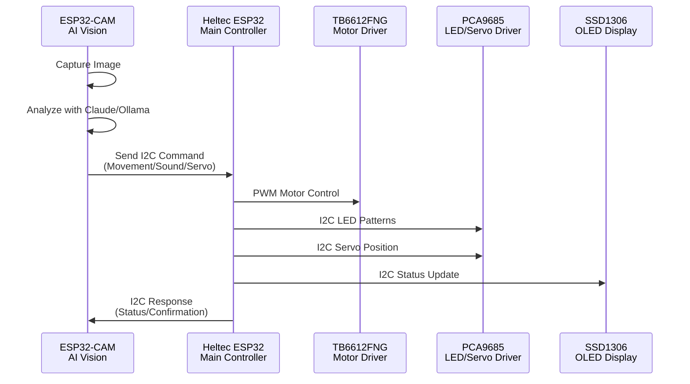
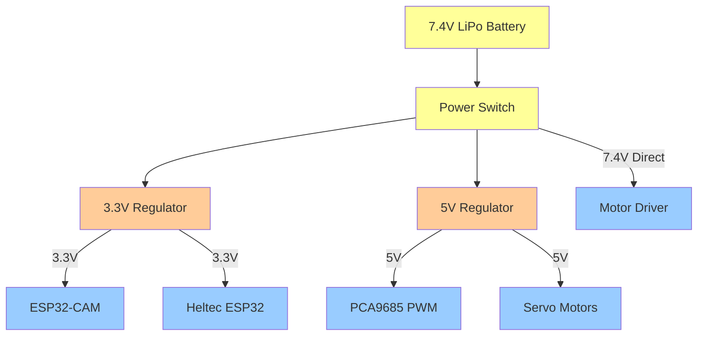

# RoboCar Hardware Pin Connections

## System Architecture Diagram

```mermaid
graph TB
    subgraph "ESP32-CAM Module"
        CAM[ESP32-CAM<br/>AI Vision Controller]
        CAMERA[OV2640 Camera]
        CAM_GPIO14[GPIO14 SCL]
        CAM_GPIO15[GPIO15 SDA]
        
        CAM --- CAMERA
        CAM --- CAM_GPIO14
        CAM --- CAM_GPIO15
    end
    
    subgraph "Heltec WiFi LoRa 32 V1"
        MAIN[Heltec ESP32<br/>Main Controller]
        OLED[SSD1306 OLED<br/>128x64]
        
        MAIN_GPIO33[GPIO33 SDA]
        MAIN_GPIO35[GPIO35 SCL]
        MAIN_GPIO4[GPIO4 SDA]
        MAIN_GPIO15[GPIO15 SCL]
        MAIN_GPIO16[GPIO16 RST]
        MAIN_GPIO21[GPIO21 SDA]
        MAIN_GPIO22[GPIO22 SCL]
        
        MAIN --- MAIN_GPIO33
        MAIN --- MAIN_GPIO35
        MAIN --- MAIN_GPIO4
        MAIN --- MAIN_GPIO15
        MAIN --- MAIN_GPIO16
        MAIN --- MAIN_GPIO21
        MAIN --- MAIN_GPIO22
        
        MAIN_GPIO4 --- OLED
        MAIN_GPIO15 --- OLED
        MAIN_GPIO16 --- OLED
    end
    
    subgraph "PCA9685 PWM Driver"
        PCA[PCA9685<br/>16-Channel PWM<br/>Address: 0x40]
        RGB1[RGB LED 1]
        RGB2[RGB LED 2]
        RGB3[RGB LED 3]
        RGB4[RGB LED 4]
        SERVO_PAN[Pan Servo<br/>Camera Mount]
        SERVO_TILT[Tilt Servo<br/>Camera Mount]
        
        PCA --- RGB1
        PCA --- RGB2
        PCA --- RGB3
        PCA --- RGB4
        PCA --- SERVO_PAN
        PCA --- SERVO_TILT
    end
    
    subgraph "Motor Driver TB6612FNG"
        TB6612[TB6612FNG<br/>Dual H-Bridge]
        MOTOR_L[Left Motor]
        MOTOR_R[Right Motor]
        
        TB6612 --- MOTOR_L
        TB6612 --- MOTOR_R
    end
    
    subgraph "Audio"
        PIEZO[Piezo Buzzer]
    end
    
    subgraph "Power"
        BATTERY[7.4V LiPo Battery]
        POWER_SWITCH[Power Switch]
        
        BATTERY --- POWER_SWITCH
    end
    
    %% Inter-board I2C Communication
    CAM_GPIO14 -.->|SCL| MAIN_GPIO35
    CAM_GPIO15 -.->|SDA| MAIN_GPIO33
    
    %% PCA9685 I2C Bus
    MAIN_GPIO21 -.->|SDA| PCA
    MAIN_GPIO22 -.->|SCL| PCA
    
    %% Motor Control PWM
    MAIN -.->|GPIO23 PWMA| TB6612
    MAIN -.->|GPIO2 AIN1| TB6612
    MAIN -.->|GPIO4 AIN2| TB6612
    MAIN -.->|GPIO13 BIN1| TB6612
    MAIN -.->|GPIO15 BIN2| TB6612
    MAIN -.->|GPIO12 PWMB| TB6612
    MAIN -.->|GPIO25 STBY| TB6612
    
    %% Piezo Control
    MAIN -.->|GPIO26 PWM| PIEZO
    
    %% Power Distribution
    POWER_SWITCH -.->|7.4V| MAIN
    POWER_SWITCH -.->|7.4V| CAM
    POWER_SWITCH -.->|5V Reg| TB6612
    POWER_SWITCH -.->|5V Reg| PCA
    
    classDef esp32cam fill:#ff9999
    classDef heltec fill:#99ccff
    classDef i2c fill:#99ff99
    classDef motor fill:#ffcc99
    classDef power fill:#ffff99
    
    class CAM,CAMERA esp32cam
    class MAIN,OLED heltec
    class PCA,RGB1,RGB2,RGB3,RGB4,SERVO_PAN,SERVO_TILT i2c
    class TB6612,MOTOR_L,MOTOR_R,PIEZO motor
    class BATTERY,POWER_SWITCH power
```



## Detailed Pin Mapping

### ESP32-CAM Pin Assignments
```
Pin    | Function              | Connected To
-------|----------------------|------------------
GPIO14 | I2C SCL (Master)     | Heltec GPIO35
GPIO15 | I2C SDA (Master)     | Heltec GPIO33
GPIO0  | Camera Clock         | OV2640
GPIO1  | Camera Data[2]       | OV2640
GPIO2  | Camera Data[3]       | OV2640
GPIO3  | Camera Data[4]       | OV2640
GPIO4  | Camera Data[5]       | OV2640
GPIO5  | Camera Data[6]       | OV2640
GPIO6  | Camera Data[7]       | OV2640
GPIO7  | Camera Data[8]       | OV2640
GPIO8  | Camera Data[9]       | OV2640
GPIO9  | Camera Flash         | LED (Optional)
GPIO10 | Camera HREF          | OV2640
GPIO11 | Camera PCLK          | OV2640
GPIO12 | Camera VSYNC         | OV2640
GPIO13 | Camera Reset         | OV2640
GND    | Ground               | Common Ground
3.3V   | Power                | Regulated 3.3V
5V     | Power Input          | 7.4V Battery
```

### Heltec WiFi LoRa 32 V1 Pin Assignments
```
Pin    | Function              | Connected To
-------|----------------------|------------------
GPIO33 | I2C SDA (Slave)      | ESP32-CAM GPIO15
GPIO35 | I2C SCL (Slave)      | ESP32-CAM GPIO14
GPIO4  | OLED SDA             | SSD1306
GPIO15 | OLED SCL             | SSD1306
GPIO16 | OLED Reset           | SSD1306
GPIO21 | PCA9685 SDA          | PCA9685 PWM Driver
GPIO22 | PCA9685 SCL          | PCA9685 PWM Driver
GPIO23 | Motor PWM A          | TB6612FNG PWMA
GPIO2  | Motor Direction A1   | TB6612FNG AIN1
GPIO4  | Motor Direction A2   | TB6612FNG AIN2
GPIO13 | Motor Direction B1   | TB6612FNG BIN1
GPIO15 | Motor Direction B2   | TB6612FNG BIN2
GPIO12 | Motor PWM B          | TB6612FNG PWMB
GPIO25 | Motor Standby        | TB6612FNG STBY
GPIO26 | Piezo PWM            | Piezo Buzzer
GND    | Ground               | Common Ground
3.3V   | Logic Power          | Regulated 3.3V
5V     | Motor Power          | 7.4V Battery
```

### PCA9685 PWM Channel Assignments
```
Channel | Function              | Device
--------|----------------------|------------------
0       | RGB LED 1 Red        | Front Left LED
1       | RGB LED 1 Green      | Front Left LED
2       | RGB LED 1 Blue       | Front Left LED
3       | RGB LED 2 Red        | Front Right LED
4       | RGB LED 2 Green      | Front Right LED
5       | RGB LED 2 Blue       | Front Right LED
6       | RGB LED 3 Red        | Rear Left LED
7       | RGB LED 3 Green      | Rear Left LED
8       | RGB LED 3 Blue       | Rear Left LED
9       | RGB LED 4 Red        | Rear Right LED
10      | RGB LED 4 Green      | Rear Right LED
11      | RGB LED 4 Blue       | Rear Right LED
12      | Reserved             | Future Expansion
13      | Reserved             | Future Expansion
14      | Pan Servo            | Camera Mount
15      | Tilt Servo           | Camera Mount
```

## I2C Bus Configuration

### Bus 1: Inter-board Communication
- **Master**: ESP32-CAM (GPIO14/15)
- **Slave**: Heltec ESP32 (GPIO33/35)
- **Address**: 0x42
- **Frequency**: 100kHz
- **Purpose**: AI commands → Hardware control

### Bus 2: PCA9685 Control
- **Master**: Heltec ESP32 (GPIO21/22)
- **Slave**: PCA9685 PWM Driver
- **Address**: 0x40
- **Frequency**: 400kHz
- **Purpose**: LED patterns & servo control

### Bus 3: OLED Display
- **Master**: Heltec ESP32 (GPIO4/15/16)
- **Slave**: SSD1306 OLED
- **Address**: 0x3C
- **Frequency**: 400kHz
- **Purpose**: Status display

## Communication Flow



## Power Distribution



## Notes

1. **GPIO Conflicts Avoided**: Careful pin selection avoids conflicts between LoRa, I2C buses, and motor control
2. **Isolation**: Each I2C bus serves a specific function to prevent interference
3. **Power Management**: Multiple voltage levels properly regulated for different components
4. **Expandability**: Reserved PCA9685 channels for future sensors/actuators
5. **Safety**: Motor standby pin allows emergency stop functionality